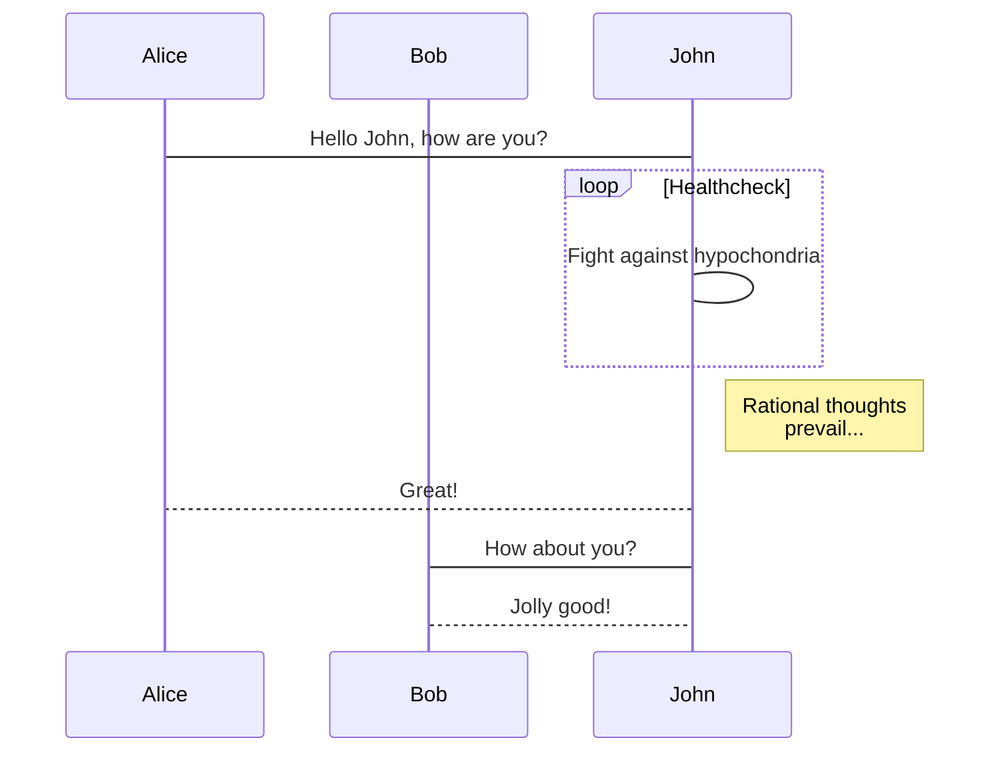
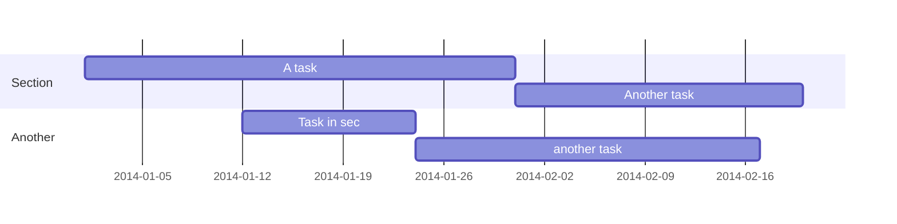







```mermaid
sequenceDiagram
  participant Alice
  participant Bob
  Alice->John: Hello John, how are you?
  loop Healthcheck
      John->John: Fight against hypochondria
  end
  Note right of John: Rational thoughts <br/>prevail...
  John-->Alice: Great!
  John->Bob: How about you?
  Bob-->John: Jolly good!
```

```mermaid
gantt
  dateFormat  YYYY-MM-DD
  section Section
  A task           :a1, 2014-01-01, 30d
  Another task     :after a1  , 20d
  section Another
  Task in sec      :2014-01-12  , 12d
  another task      : 24d
```
