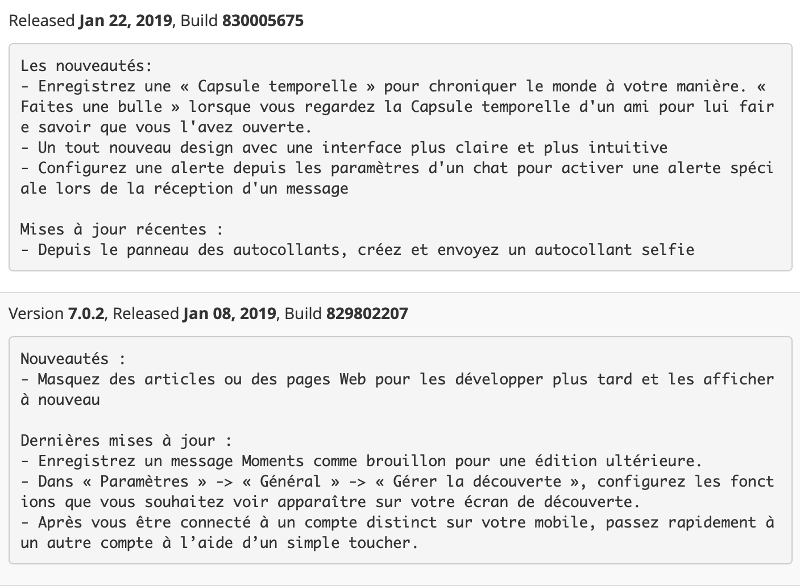
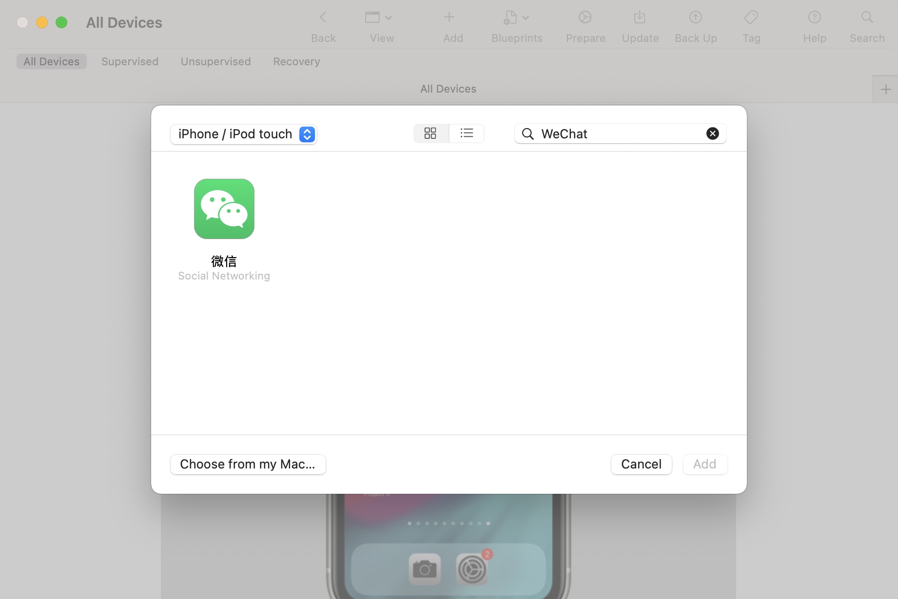
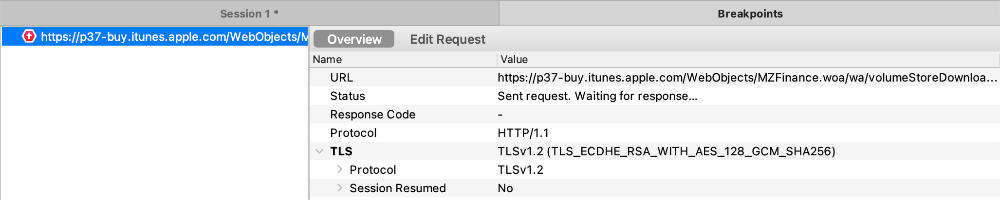
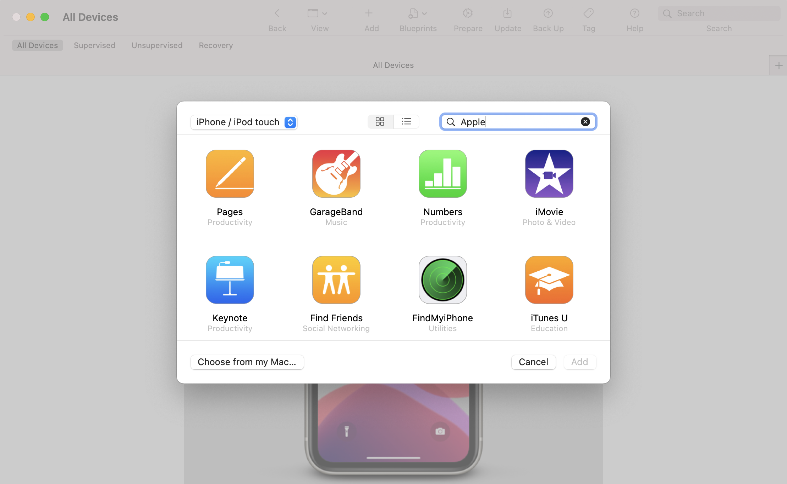

## 如何获取 ipa

要获取应用下载链接，在未越狱的情况下，由于每一个 `ipa` 都和 Apple ID 绑定，并且有 Apple 的签名，所以必须要通过官方途径配合 Apple 账号下载。在 Windows 上可以直接通过 iTunes 方式获取 `ipa`，而在 macOS 上目前有两种获取 `ipa` 方式：
1. iTunes
2. Apple Configurator


### ipa 的下载流程

#### iTunes 的 ipa 下载流程

在 iTunes 下，一次购买下载 `ipa` 的流程由一个发往服务器为 `buy.itunes.apple.com`、Path 为 `WebObjects/MZBuy.woa/wa/buyProduct` 的请求作为开始。构造请求时会向 `appExtVrsId` 字段注入 Build 号，来指定获取具体某个版本的 `ipa`（默认为最新上架的一个 Build Number），再利用 `GUID` 和 `DSID` 生成 `kbsync` 请求鉴权信息，完成 Request 构造。收到 Response 之后，分析 Response Body 中的 `XML` 文件，可以找到包含签名后的下载链接，iTunes 利用这个链接完成 `ipa` 的下载，链接的形式如下所示。

```shell
https://iosapps.itunes.apple.com/itunes-assets/Purple114/v4/bf/36/04/bf360426-5231-2db4-ff0b-430c788ec5c6/pre-thinned13659119744838198600.lc.7948000812590706.EOTME2CVXCUZU.signed.dpkg.ipa?accessKey=${accessKey}
```

可以看到请求的 `ipa` 为 `pre-thinned13......ipa`；Path 为 `itunes-assets/Purple114/v4/bf/36/04/bf360426-5231-2db4-ff0b-430c788ec5c6`，由于同一个应用，不同设备的 `ipa` 包都是不同的，所以文件服务器上必然有大量包含了 `pre-thinned` 的 ipa，所以 `hash` 过的 Path 可用于文件索引加速，但会使得反向推算特定版本特定设备的 `ipa` 变得几乎不可能；`accessKey` 为 public key 且具有时效性，用于文件访问鉴权。

综上可以得知 `ipa` 文件路径难以推测，并且请求具有实效性，因此在 Response 处没有太多的可挖掘的点。而将 `appExtVrsId` 这个字段作为切入点是比较合理的。


#### Apple Configurator 的 ipa 下载流程

在 Apple Configurator 2 中，苹果针对请求做了修改 Path 变为 `WebObjects/MZFinance.woa/wa/volumeStoreDownloadProduct`，请求的 Plist 如下所示。

```
<key>guid</key>
<string>${guid}</string>
<key>kbsync</key>
<string>${kbsync}</string>
<key>salableAdamId</key>
<string>414478124</string>
<key>serialNumber</key>
<string>${serialNumber}</string>
```

可以发现并没有字段可以来指定版本信息，一筹莫展。


### 通过 iTunes 获取 ipa

> ⚠️ 2020 年 03 月 18 日 后，从 iTunes 12.6.5 的 App Store 下载应用会直接 SSL 握手失败，iTunes 的方式失效。

自 macOS Mojave 之后，iTunes 的 App Store 的功能就逐渐淡出舞台了，[iTunes 12.6.5.3](https://secure-appldnld.apple.com/itunes12/091-87821-20180912-69177170-B085-11E8-B6AB-C1D03409AD2A/iTunes12.6.5.dmg) 是最后一个可以浏览 App Store 的 iTunes 版本。


#### 安装 iTunes 12.6.5.3

在 Mojave 之后安装 iTunes 会受到限制，需要绕过校验系统版本的 iTunes Installer，直接提取安装包内部的 iTunes.app 移至 /Applications 使用。在 macOS Mojave 10.14.4 之后，苹果直接对 iTunes 版本做了限制，打开 iTunes 会提示你当前系统不支持 12.6.5，这时候需要提高 info.plist 里的版本号绕过 macOS 的校验，整体流程参考下方的 Apple Script。

此外如果启动 iTunes 时提示 "iTunes Library.itl" 错误，则需要移除 Music 目录下 iTunes 文件夹内 iTunes Library.itl 文件。

```cpp
set theDMG to choose file with prompt "Please select iTunes dmg file:" of type {"dmg"}
do shell script "hdiutil mount " & quoted form of POSIX path of theDMG
do shell script "pkgutil --expand /Volumes/iTunes/Install\\ iTunes.pkg ~/tmp"
do shell script "hdiutil unmount /Volumes/iTunes/"
do shell script "cd ~/tmp/iTunesX.pkg;" & "cat Payload | gunzip -dc |cpio -i;" & "ditto ~/tmp/iTunesX.pkg/Applications/iTunes.app ~/tmp/iTunes.app;"
do shell script "plutil -replace CFBundleGetInfoString -string 'iTunes 13.6.5.3' ~/tmp/iTunes.app/Contents/Info.plist"
do shell script "plutil -replace CFBundleShortVersionString -string 13.6.5 ~/tmp/iTunes.app/Contents/Info.plist"
do shell script "plutil -replace CFBundleVersion -string 13.6.5 ~/tmp/iTunes.app/Contents/Info.plist"
do shell script "plutil -replace CFBundleVersion -string 'iTunes 13.6.5.3' ~/tmp/iTunes.app/Contents/version.plist"
do shell script "plutil -replace CFBundleShortVersionString -string 13.6.5 ~/tmp/iTunes.app/Contents/version.plist"
set question to display dialog "Copy patched iTunes to /Applications?" buttons {"Yes", "No"} default button 1
set answer to button returned of question
if answer is equal to "Yes" then
    do shell script "ditto ~/tmp/iTunes.app /Applications/iTunes.app"
    display dialog "Patched iTunes.app was copied to /Applications" buttons {"Ok"}
end if
set question to display dialog "Save patched iTunes as dmg?" buttons {"Yes", "No"} default button 1
set answer to button returned of question
if answer is equal to "Yes" then
    do shell script "hdiutil create -format UDRO -srcfolder ~/tmp/iTunes.app ~/Desktop/iTunes13.6.5.dmg"
    display dialog "iTunes13.6.5.dmg was saved on Desktop" buttons {"Ok"}
end if
set question to display dialog "Save patched iTunes as an installable pkg?" buttons {"Yes", "No"} default button 1
set answer to button returned of question
if answer is equal to "Yes" then
    do shell script "pkgbuild --component ~/tmp/iTunes.app --install-location /Applications ~/Desktop/iTunes13.6.5.pkg"
    display dialog "iTunes13.6.5.pkg was saved on Desktop" buttons {"Ok"}
end if
set question to display dialog "Save iTunesAccess as an installable pkg?" buttons {"Yes", "No"} default button 1
set answer to button returned of question
if answer is equal to "Yes" then
    do shell script "cd ~/tmp/iTunesAccess.pkg;" & "cat Payload | gunzip -dc |cpio -i;" & "mkdir ~/tmp/a;" & "ditto ~/tmp/iTunesAccess.pkg/System ~/tmp/a/System;"
    do shell script "pkgbuild --root ~/tmp/a --install-location / ~/Desktop/iTunesAccess.pkg"
    display dialog "iTunesAccess.pkg was saved on Desktop" buttons {"Ok"}
end if
set question to display dialog "Delete temporary ~/tmp folder?" buttons {"Yes", "No"} default button 1
set answer to button returned of question
if answer is equal to "Yes" then
    do shell script "rm -rf ~/tmp"
    display dialog "~/tmp was deleted" buttons {"Ok"}
    return
end if
```


#### 从 iTunes 抓取下载数据

以 Charles 为例，按照以下步骤进行下载地址抓取

1. 打开 Charles，配置证书打开，SSL Proxying 加入 `*.apple.com`。
2. 开 iTunes，选择一个应用下载，以 WeChat 为例。
3. 在 Charles 中过滤 path 为 `WebObjects/MZBuy.woa/wa/buyProduct` 的请求，添加 `breakpoints`。
4. 查看 Response Body 中 `XML` 字段 `softwareVersionExternalIdentifiers`，该数组包含了所有可下载的 Build 号。

```xml
<key>softwareVersionExternalIdentifiers</key>
<array>
    ...
    <integer>717062721</integer>
    <integer>719842773</integer>
    <integer>726302660</integer>
    <integer>746082682</integer>
    <integer>811222902</integer>
    <integer>811530944</integer>
    <integer>811669817</integer>
    <integer>811953630</integer>
    ...
</array>
```

5. 根据 [MIXRANK](https://mixrank.com/appstore/apps/414478124/versions) 查询版本对应的 Build 号。



6. 取消之前的下载，并再次下载触发断点，编辑 Request，将请求的 `appExtVrsId` 字段的值替换成对应的版本号，并 Excute。

```xml
<key>appExtVrsId</key>
<string>830005675</string>
```

7. 完成下载之后可得到指定版本的 ipa。


### 使用 Apple Configurator

> 一筹莫展

#### 安装 Apple Configurator 2 

[点击链接](https://apps.apple.com/cn/app/apple-configurator-2/id1037126344) 从 Mac App Store 直接安装 Apple Configurator 2 


#### 如何从 Apple Configurator 2 抓取下载数据

首先从 Apple Configurator 2 发起下载请求，以 WeChat 为例，选择 WeChat 点击 Add。



从 Apple Configurator 2 抓取下载数和 iTunes 的唯一区别点在于断点的位置，如下图所示。



其余流程在理论上没有任何区别，但如[“Apple Configurator 的 ipa 下载流程”](#Apple-Configurator-的-ipa-下载流程)中所述，核心在于如何修改版本，暂时还没找到方法，目前苹果应该是把 Build Number 查询与修改这一步放到了服务端。


## 安装 ipa

使用 Apple Configurator 2，添加一个 App，点击 Choose from my Mac 选择上一步骤中抓取到的 ipa。



按步骤安装完成 ipa 的部署即可。


## 进一步了解

1. [iTunes 12.6.5.3 on MacOS Catalina 10.15](https://forums.macrumors.com/threads/itunes-12-6-5-3-on-macos-catalina-10-15.2184518/)
2. [DSID](https://www.theiphonewiki.com/wiki/DSID)
3. [使用 iTunes 在业务环境中部署应用](https://support.apple.com/zh-cn/HT208079)
4. [Updating apps using iTunes 12.6.5.3](https://discussions.apple.com/thread/251200031?page=2)
5. [iTunes 12.6.5 Apps don’t download since 18/03/2020](https://discussions.apple.com/thread/251211447)
6. [Public-key cryptography](https://en.wikipedia.org/wiki/Public-key_cryptography)