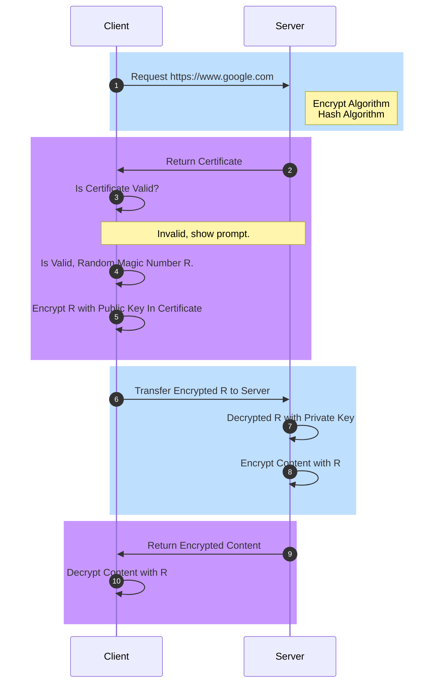

Hypertext Transfer Protocol Secure，超文本传输安全协议，又称 HTTP over TLS。是经由 HTTP 进行通信，并利用 SSL/TLS 来加密。HTTPS 主要目的是为了提供对服务器的身份认证，与传输过程中的数据完整性不被篡改，最早由网景（Netscape）在 1994 年提出，应用在网景领航员浏览器中。

HTTP 在作数据传输协议使用时，由于是明文传输无任何安全保证，会存在内容被窃听的问题；由于没有身份认证机制，通信过程中会面临中间人攻击，例如数据被篡改、服务器身份伪装等。正因为 HTTP 存在这些风险问题才诞生了 HTTPS。

HTTPS 本质上是一个复合协议，由 HTTP、TSL/SSL、TCP 协同工作，因此会涉及到较多领域的内容比如密码学、公钥与私钥、加密与认证、数字证书、数字签名等。

此外 HTTPS 可能会与 [RFC 2660](https://tools.ietf.org/pdf/rfc2660.pdf) 中的安全超文本传输协议 S-HTTP 相混淆。两者都为 HTTP 安全传输的实现，S-HTTP 为应用层协议，主要对传输内容加密；HTTPS 的核心为 SSL/TSL，SSL/TSL 协议位于传输层与应用层之间，确保整个通信过程都是安全的。

## HTTPS 通信流程

如上文所述，HTTPS 是对 HTTP 的扩展，由三部分组成，通信流程可以简化为：

1. 通信双方通过三次握手建立 TCP 连接
1. 通信双方通过四次握手建立 TLS 连接
1. HTTP Client 向 Server 发送请求，Server 响应返回 Response

### 建立 TCP 链接

更多关于 TCP 的内容从以下这篇文章进一步了解。



### 建立 TLS 链接

建立 TCP 链接后需要进行 TLS 握手，以浏览器和服务器的通信为例，通常 HTTPS 做单向认证，用于鉴别服务端的真伪，简化流程的如下：

1. 浏览器向服务器的 TLS 端口（一般为 443）发起请求，此次请求携带了支持的加密算法和哈希算法。
1. 服务器收到请求，选择浏览器支持的加密算法和哈希算法。 
1. 服务器将数字证书返回给浏览器，这里的数字证书可以是向权威机构比如 CA 申请的，也可以是自签名证书。 
1. 浏览器进入数字证书认证环节，这一部分是浏览器内置的 TLS 模块完成的。
    - 首先浏览器会从系统内置的证书列表中索引，找到服务器下发证书对应的机构。
    - 以 macOS 为例，Safari、Edge 和 Chrome 会从系统的 Keychain Access 的根证书去索引，如果 Keychain 中有可疑证书是有漏洞可钻；而 Firefox 安全度更高，会在浏览器内置的证书中索引。 
    - 如果没有找到，此时就会提示用户该证书是不是由权威机构颁发，是不可信任的。
    - 如果查到了对应的机构，则取出该机构颁发的公钥。
    - 用机构的证书公钥解密得到证书的内容和证书数字签名，内容包括服务器的地址、服务器的公钥、证书的有效期等。
    - 浏览器首先验证数字签名的合法性，验证过程类似 Bob 和 Pat 的通信过程。
    - 签名通过后，浏览器验证证书记录的网址是否和当前网址是一致的，不一致会提示用户。
    - 如果网址一致会检查证书有效期，证书过期了也会提示用户。
    - 以上都通过认证时，浏览器就可以安全使用证书中的服务器公钥了。
    - 浏览器生成一个随机数 R，并使用服务器的公钥对 R 进行加密。
1. 浏览器将加密之后的 R 传送给服务器。
1. 服务器用自己的私钥解密得到 R。
1. 服务器以 R 为密钥使用了对称加密算法加密网页内容并传输给浏览器。 
1. 浏览器以 R 为密钥使用之前约定好的解密算法获取网页内容。

整个过程主要为了认证服务端证书以及的公钥的合法性，因为非对称加密计算量较大，整个通信过程只会用到一次非对称加密算法，主要是用来保护传输客户端生成的 R 用于对称加密的随机数私钥。后续内容的加解密都是通过一开始约定好的对称加密算法进行的。

更多关于 SSL/TLS 的详细内容从以下这篇文章进一步了解。



## 进一步了解

1. [HTTPS](https://en.wikipedia.org/wiki/HTTPS).
1. [HTTP Over TLS](https://tools.ietf.org/pdf/rfc2818.pdf).
1. [The Secure HyperText Transfer Protocol](https://tools.ietf.org/pdf/rfc2660.pdf).