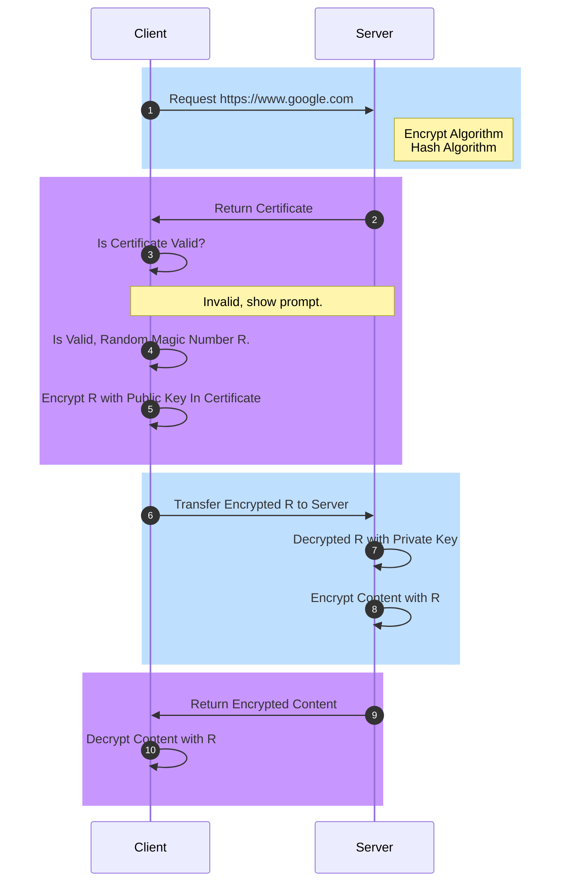

HTTP 协议 (Hypertext Transfer Protocol) 作为 C/S 模式下常用的协议，主要用于传输超文本，本质上 HTTP 为明文无任何安全保证，主要存在三大风险:

1. 被窃听的风险，第三方可以截获并查看你的内容
2. 被篡改的危险，第三方可以截获并修改你的内容
3. 被冒充的风险，第三方可以伪装成通信方与你通信

HTTP 因为存在以上三大安全风险，才诞生了 HTTPS，HTTPS 会涉及到很多领域比如 SSL/TLS、密码学、公钥与私钥、加密与认证、数字证书、数字签名等。要讲清楚 HTTPS，首先需要了解什么是数字签名。

## 数字签名是什么

HTTPS 的通信过程中会涉及到加密、解密与认证的概念，所以首先需要了解什么是数字签名，Bob 的故事可以很好的帮助我们理解签名，从以下这篇文章进一步了解。



## HTTPS 的通信过程

通过上文的 Bob 的故事，在对数字签名有了个基本的概念之后，进一步了解 HTTPS 的设计逻辑。HTTPS 是基于基本的加密、解密、认证等概念的一个安全通信的过程。HTTPS 由 HTTP 协议和 SSL/TLS 协议组成，HTTP 负责传输，SSL/TLS 负责加密解密等安全处理，所以 HTTPS 的核心在 SSL/TLS 上面。整个 HTTPS 一共 7 次握手，3 次 TCP 握手，四次 SSL/TSL 握手。

### HTTPS 握手与单向认证

以浏览器和服务器的通信为例，通常 HTTPS 做单向认证，用于鉴别服务端的真伪，SSL/TSL 建立通信流程的如下：

1. 浏览器发起往服务器的 SSL 端口一般为 443 发起请求，此次请求携带了支持的加密算法和哈希算法。
1. 服务器收到请求，选择浏览器支持的加密算法和哈希算法。 
1. 服务器将数字证书返回给浏览器，这里的数字证书可以是向权威机构比如 CA 申请的，也可以是自签名证书。 
1. 浏览器进入数字证书认证环节，这一部分是浏览器内置的 SSL/TLS 模块完成的。
    - 首先浏览器会从系统内置的证书列表中索引，找到服务器下发证书对应的机构。
    - 以 macOS 为例，Safari、Edge 和 Chrome 会从系统的 Keychain Access 的根证书去索引，如果 Keychain 中有可疑证书是有漏洞可钻；而 Firefox 安全度更高，会在浏览器内置的证书中索引。 
    - 如果没有找到，此时就会提示用户该证书是不是由权威机构颁发，是不可信任的。
    - 如果查到了对应的机构，则取出该机构颁发的公钥。
    - 用机构的证书公钥解密得到证书的内容和证书数字签名，内容包括服务器的地址、服务器的公钥、证书的有效期等。
    - 浏览器首先验证数字签名的合法性，验证过程类似 Bob 和 Pat 的通信过程。
    - 签名通过后，浏览器验证证书记录的网址是否和当前网址是一致的，不一致会提示用户。
    - 如果网址一致会检查证书有效期，证书过期了也会提示用户。
    - 以上都通过认证时，浏览器就可以安全使用证书中的服务器公钥了。
    - 浏览器生成一个随机数 R，并使用服务器的公钥对 R 进行加密。
1. 浏览器将加密之后的 R 传送给服务器。
1. 服务器用自己的私钥解密得到 R。
1. 服务器以 R 为密钥使用了对称加密算法加密网页内容并传输给浏览器。 
1. 浏览器以 R 为密钥使用之前约定好的解密算法获取网页内容。

前 5 步其实就是 HTTPS 的握手过程，这个过程主要是认证服务端证书以及的公钥的合法性。因非对称加密计算量较大，整个通信过程只会用到一次非对称加密算法，主要是用来保护传输客户端生成的 用于对称加密的随机数私钥。后续内容的加解密都是通过一开始约定好的对称加密算法进行的。

## SSL/TSL 

SSL/TLS 是 HTTPS 安全性的核心模块，TLS 的前身是 SSL，关系如下。

| TSL | SSL |
| - | - |
| v1.0 | v3.1 | 
| v1.1 | v3.2 | 
| v1.2 | v3.3 |

SSL/TLS 建立于 TCP 之上，为应用层协议。TLS 协议主要由两层构成，为 TLS Record Protocol 和 TLS Handshaking Protocols。前者基于一些可信任的协议如 TCP，为上层协议提供数据封装、压缩、加密等基本功能的支持，保证数据传输过程中的完整性和私密性，属于较低层的协议，而后者负责握手过程中的身份认证。

更多关于 SSL/TSL 从以下这篇文章进一步了解。



## 进一步了解

1. [The Secure HyperText Transfer Protocol](https://tools.ietf.org/pdf/rfc2660.pdf)