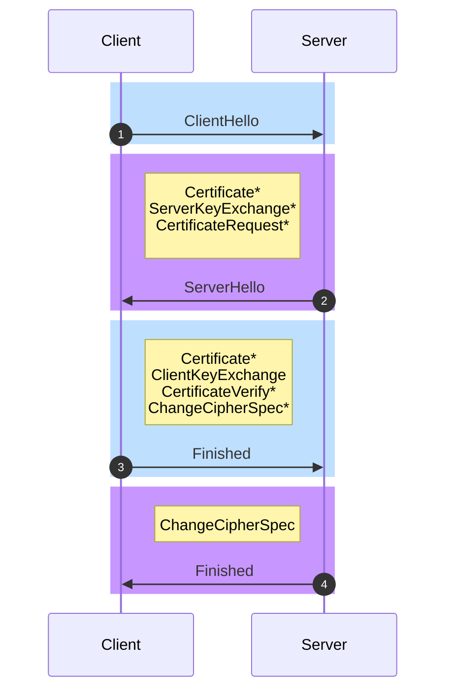

## 前言

传输层安全协议 Transport Layer Security Protocol 是一种通过数字签名确保数据完整性以及实现互相身份认证、使用加密确保私密性来实现客户端和服务器之间的安全通讯，其位于面向连接的网络层协议和应用层协议之间，是一种协议层。

{}

### TLS 的发展历史

{}

TLS 的前身为安全套接字层 Secure Socket Layer。SSL 由网景 Netscape 在 1994 年设计并与同期提出的 HTTPS 一起应用在网景浏览器上，当时主要为 HTTPS 提供 SSL 层的加密服务，目的是为保护整条 Web 通信传输的链路安全，提供了 Client 以及 Server 的身份认证防止中间人伪装；提供加密数据防止被窃取；保证传输过程中数据完整性不被中间人篡改。

随后 SSL 被 [ISOC](https://www.internetsociety.org) 组织成员 [IETF](https://www.ietf.org) 标准化，于 1999 年公布 TLS 1.0 标准文件 [RFC 2246](https://tools.ietf.org/pdf/rfc2246.pdf)，完整的时间线如下：

- Netscape 首席科学家 Taher Elgamal 设计开发了 SSL 1.0，但由于有安全问题从未发布。 
- 1995 年，Netscape 设计并发布 SSL 2.0，由于有安全问题很快一年后被 SSL 3.0 替代，于 2011 年被弃用 [RFC6176](https://tools.ietf.org/pdf/rfc6176.pdf)。
- 1996 年，Netscape 设计发布 SSL 3.0，其草案之后作为历史文献由 IETF 在 2011 年通过 [RFC 6101](https://toolietf.org/pdf/rfc6101.pdf) 发表，于 2015 年被弃用 [RFC 7568](https://toolietf.org/pdf/rfc6101.pdf)。 
- 1999 年 IETF 将 SSL 进行标准化，发布 TLS 1.0 标准 [RFC 2246](https://tools.ietf.org/pdf/rfc2246.pdf)。
- 2006 年 IETF 发布 TLS 1.1 标准 [RFC 4346](https://tools.ietf.org/pdf/rfc4346.pdf)。
- 2008 年 IETF 发布 TLS 1.2 标准 [RFC 5246](https://tools.ietf.org/pdf/rfc5246.pdf)。
- 2018 年 IETF 发布 TLS 1.3 标准 [RFC 8446](https://tools.ietf.org/pdf/rfc8446.pdf)。

下文会统一使用 TLS 进行描述。

### TLS 的构成

TLS 具体由两层构成：

1. TLS 记录协议 The TLS Record Protocol，建立在可靠的传输协议如 TCP 之上，为高层协议提供数据封装、压缩、加密等基本功能的支持，保证数据传输过程中的完整性和私密性，属于较低层的协议。
1. TLS 握手协议 The TLS Handshake Protocol，建立在 TLS 记录协议之上，用于在实际的数据传输开始前，通讯双方进行身份认证、协商加密算法、交换加密密钥等。

TLS 协议的一大优势是与高层的应用层协议如 HTTP、SSH、Telnet 等无耦合，应用层协议能透明地运行在 TLS 之上，由 TLS 进行建立加密通道需要的协商和认证。应用层协议传送的数据在通过 TLS 协议层时都会被加密，从而保证通信的私密性。

从上层的 TLS 握手流程作为切入点，先从数字签名的概念讲起。

## 数字签名是什么

TLS 握手过程中会涉及到加密、解密与认证的概念，所以首先需要了解什么是数字签名。Bob 的故事可以很好的帮助理解数字签名，从以下这篇文章进一步了解。



## TLS Handshaking Protocols

通过上文的 Bob 的故事，在对数字签名有了个基本的概念之后，进一步了解 TLS 握手的设计逻辑。TLS 握手是一个集加密、解密、认证等概念的建立连接过程。

### TLS 1.0 握手流程



#### 1. Client Hello

客户端向服务端发送 `ClientHello` 消息，客户端提供：

- 支持的协议版本
- 客户端生成的随机数 **`ClientHello.random`**
- 支持的压缩算法以及
- 支持加密算法

#### 2. Server Hello

服务端收到客户端支持的协议版本、加密算法等信息后，向客户端发出回应：

- 发送 `ServerHello`，包含了指定的协议版本、加密方法、会话 ID，以及服务端生成的随机数 **`ServerHello.random`**。
- 向客户端发送 Certificate，服务端的证书链，其中包含证书支持
    的域名、发行方和有效期等信息。
- 向客户端发送 `ServerKeyExchange` 消息，传递服务器公钥以及数字签名等信息。
- 向客户端发送 `CertificateRequest` 请求，可选步骤，用于验证客户端的证书。
- 发送 `ServerHelloDone`，通知客户端服务端所有的响应已完成。

#### 3. Client Response

客户端收到服务端的信息后，首先会对服务器证书进行验证，检查服务器证书是否是可信机构颁布。随后对证书中的域名与实际域进行一致性校验、检验证书是否过期等，如果验证失败就会发出警告，询问是否还要继续通信。整个验证过程与《什么是签名》一文中 Bob 和 Pat 通信的验证原理是一致的，验证完成之后，客户端对服务端发出响应：

- 向服务端发送 `ClientKeyExchange` 消息，包含使用服务端公钥 RSA 加密的 `Premaster Secret` 消息。
- 向服务端发送 `ChangeCipherSpec` 消息，告知服务端后续数据启用约定的算法加密。
- 向服务端发送 Finished，其中包含加密后的之前所有的握手信息。

#### 4. Server Response

服务端收到 `ChangeCipherSpec` 和 Finished 后：

1. 向客户端发送 `ChangeCipherSpec` 消息，通知客户端后续数据启用约定的算法加密。
2. 验证客户端的 Finished，向客户端发送 Finished 消息并完成 TLS 握手，其中包含加密后的所有握手的信息。

TLS 握手核心在于 Hello Message 阶段生成的两个随机值 `ClientHello.random`、`ServerHello.random` 以及 `Premaster Secret` 共三个随机信息。通常非对称加密的计算量是比较庞大的，所以对称加密才有了必要性。`Premaster Secret` 本身即随机数，配合 Hello Message 中的两个随机数，双方用经过协商后的加密算法通过 PRF（伪随机数函数）将三个随机信息生成一个对称密钥 `Master Secret`，之后就可以使用这个密钥对称加密消息防止中间人攻击和信息窃取。

```c
master_secret = PRF(pre_master_secret, "master secret", ClientHello.random + ServerHello.random)
```

TLS 的证书是静态的，引入一种额外随机因素来保证协商出来的密钥随机性是很有必要的。使用 `Premaster Secret` 作为单纯的对称加密密钥是存在风险的，由于计算机的随机数是伪随机，TSL 协议不认为存在完全随机的随机数，为了让 `Master Secret` 不可被破解，不选择单纯使用 `Premaster Secret` 而须引入新的随机因子，三个伪随机数配合 PRF 导出的随机数就会十分接近真随机。

## TLS Record Protocol

## 进一步了解

1. [Internet Engineering Task Force](https://zh.wikipedia.org/wiki/IETF).
1. [The TLS Protocol Version 1.0](https://tools.ietf.org/pdf/rfc2246.pdf).
1. [The Transport Layer Security (TLS) Protocol Version 1.3](https://tools.ietf.org/pdf/rfc8446.pdf).
1. [Datatracker The Transport Layer Security (TLS) Protocol Version 1.3](https://datatracker.ietf.org/doc/rfc8446/).
1. [Transport Layer Security - Wikipedia](https://en.wikipedia.org/wiki/Transport_Layer_Security).
1. [那些關於SSL/TLS的二三事(九) — SSL (HTTPS)Communication | Medium](https://medium.com/@clu1022/那些關於ssl-tls的二三事-九-ssl-communication-31a2a8a888a6).