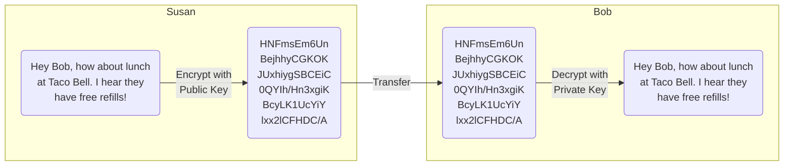
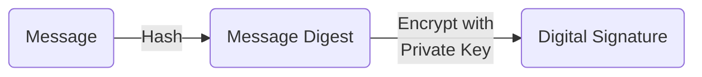
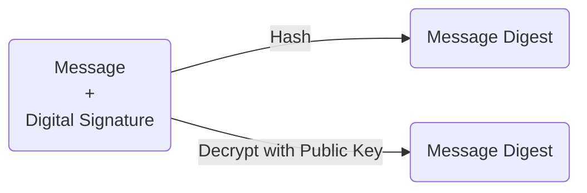
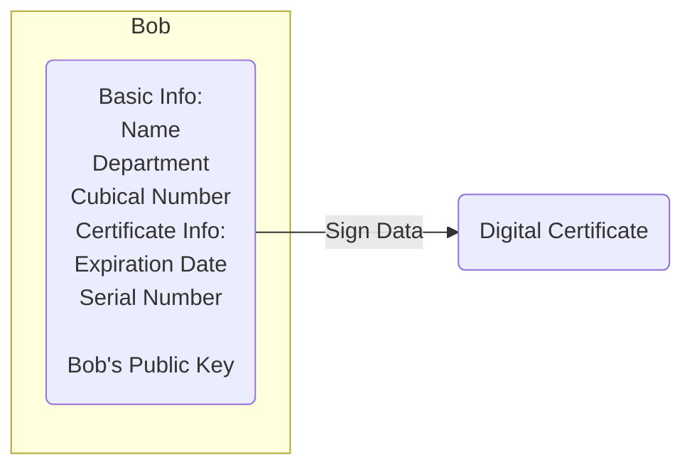

## 前言

故事的主人翁是 Bob，他有三个朋友 Pat、Doug 和 Susan。Bob 经常和他们网上冲浪，因为他的消息是明文传输的，在传递过程可能被人截获偷窥，也可能被人截获然后又篡改了，更有可能别人伪装成 Bob 本人跟他的好友通信，为了规避消息泄漏以及被篡改的风险，整个通信过程中会引入非对称加密算法以及数字签名。正文部分会添加个人的译注作为补充介绍一些背景与看法，接下来我们来看看 Bob 是怎么用非对称加密与好友通信的。

## 正文

主人翁 Bob 得到了两把钥匙。其中一把称为**公钥**，另一把称为**私钥**。

  

      
  

  

     Public Key 
     Private Key
  

>【**译注**】 
>
> 非对称加密算法（RSA）是内容加密的一类算法，它有两个密钥，公钥与私钥：
>
> - 公开的、可以被所有人都可以获取的称之为公钥。
> - 只有持有者知道，其他任何人获取不到的称之为私钥。
>
> 通过公钥加密的内容，只能通过私钥解密，同样通过私钥加密的内容也只能用公钥解密，公钥和私钥只有称谓上不同，本质上没有任何区别，是很典型的用途决定命名。通常私钥加密公钥解密，我们称之为身份认证；公钥加密私钥解密，我们称之为加密。非对称加密算法的安全性很高，但因为计算量庞大，比较消耗性能。

Bob 的公钥可供任何需要的人使用，而他的私钥由他自己保密保存。密钥用于加密信息。将信息加密意味着“干扰”，只有拥有正确密钥的人才能将其解密并恢复成可读内容。Bob 两个密钥中的任意一个密钥都可以用来加密数据，并且使用另一个密钥解密数据。

  

    

        Pat
    

    

        Susan
    

    

        Doug
    

    

        Others
    

    
<b>Bob's Co-workers</b>

  

  
&nbsp&nbsp&nbsp

  

     Public Key 
    
Anyone can get Bob's Public Key,  but Bob keeps his Private Key  to himself.

  

>【**译注**】 
>
> 这里可以理解成 Bob 把公钥直接复制成三份传输给了 Pat、Susan 以及 Doug。

Susan 可以使用 Bob 的公钥加密消息，Bob 获取到加密消息之后可以用他的私钥去解密消息。Bob 的每个同事都可以获取到 Susan 的加密消息，但在没有 Bob 的私钥的情况下，这些数据毫无价值。

>【**译注**】 
>
> 比如 Susan 要和 Bob 讨论去哪吃午饭，Susan 就可以先把自己的明文内容用 Bob 给她的公钥做一次加密，然后把加密的内容传送给 Bob，Bob 收到消息后，用他的私钥解密消息的内容。
> 
> 通常公钥加密，私钥解密的过程我们称之为加密，完整的加密过程为：
> 1. 发送方（Susan）通过可逆算法对内容 Message 用公钥进行加密，得到加密后的内容并发送
> 2. 接收方（Bob）接收 Message，并用私钥解密得到 Message，这个消息只有 Bob 的私钥能够解密
>
> 密码学范畴内，加密的目的是为了不让别人看到传送的内容，加密的策略是在特定加密算法以及双方约定的密钥的基础上进行的，比如使用非对称加密算法和用公钥加密；而解密的策略则需要相关的解密算法及约定的密钥，比如非对称加密算法和用私钥解密，整个加密的过程是可逆的。
> 
> 更多可以参考分类 [IAS. Information Assurance and Security](), [Cryptography]()

在有了私钥和对应的软件后，Bob 可以在文档和其他数据上进行数字签名。数字签名可以理解为 Bob 在数据上打上了印记，这个印记对于 Bob 来说是独一无二的，很难伪造。此外，针对已经进行过签名的数据，数字签名能够保障对数据所做的任何篡改都可以被探知。

为了给一个文档签名，Bob 的软件通过“散列化”将数据压缩成几行，这几行的数据被称为消息摘要，并且没有任何方法能够将消息摘要还原成原始数据。Bob 的软件用私钥加密生成的消息摘要，这个结果就是数字签名。

最后，Bob 的软件将数字签名附加到文档中，此时所有被散列化的数据都已经被签名。Bob 现在把文件传给了 Pat。

>【**译注**】 
>
> 假设 Bob 收到 Pat 的消息后，决定给 Pat 回复。为了防止内容被篡改或者别人伪装成他的身份跟 Pat 通信，他决定先对消息的内容用散列算法做一次处理，得到一个哈希值，Bob 又用自己的私钥对哈希值做了一次加密得到一个数字签名，然后把签名和消息一起发送给 Pat。
>
> Bob 的内容为明文传输，这个过程是可以被人拦截，但是 Bob 最担心的是内容被人篡改或者有人冒充自己跟 Pat 通信，而不是内容被窥探。这里其实涉及到了身份认证的概念，Bob 要向 Pat 证明通信的对方是 Bob 本人，同时也需要确保自己的内容是没被篡改的。

首先，Pat 的软件用 Bob 的公钥解密签名，将其还原为消息摘要。如果成功了，那么它证明了在文件上签名的人是 Bob，因为只有 Bob 才有他的私钥。随后，Pat 的软件将文档数据散列化成消息摘要，如果 Pat 生成的消息摘要与解密 Bob 的签名得到的消息摘要相同，则 Pat 知道被签名数据没有被更改。

>【**译注**】
>
> Pat 接收到了 Bob 的消息，首先用 Bob 给的公钥对签名作了解密处理，得到了哈希值 A，然后 Pat 用了同样的哈希算法对消息内容作了一次散列化处理，得到另外一个哈希值 B，对比 A 和 B 如果相同，那么可以确认内容是由 Bob 本人撰写并没有被篡改。
>
> 通常私钥加密，公钥解密的过程我们称之为身份认证，完整的认证过程为：
> 1. 发送方（Bob）通过不可逆算法对内容 Message 进行处理（散列化也就是哈希），得到的结果值 Hash Bob
> 2. 发送方（Bob）用私钥加密 Hash Bob 得到结果值作为数字签名 Digital Signature 与 Message 一起发送
> 3. 接收方（Pat）接收 Message 和 Digital Signature，用公钥解密数字签名，如果成功得到结果 Hash Bob 说明是由 Bob 的私钥进行的签名
> 4. 接收方（Pat）同样对 Message 哈希处理得到 Hash Pat
> 5. 如果 Hash Pat 和 Hash Bot 一致，则说明内容没被篡改

Doug 是我们的一个心怀不满的员工，他想欺骗 Pat。Doug 十分确定 Pat 收到一条被签名过消息以及一个属于 Bob 的公钥。在 Pat 不知情的情况下，Doug 用 Bob 的名字创建了一对密钥，带有欺骗性伪装成 Bob 并发送了这个生成的公钥。Pat 在没有亲自收到 Bob 的公钥的情况下，如何确定 Bob 的公钥是真实的？

>【**译注**】
>
> 假设 Bob 是通过网络把公钥发送给他人的，如果 Doug 或者其他任何人截获了 Bob 给 Pat 的公钥。Doug 就开始伪装成 Bob 跟 Pat 无法确认对方是否是 Bob，所以需要引入第三方机构来验证 Bob 的真伪。

碰巧 Susan 在公司内的证书颁发中心工作，Susan 只需将 Bob 的公钥以及一些关于 Bob 的身份息进行数字签名，就可以为 Bob 创建数字证书。

现在，Bob 的同事们可以检查 Bob 的受信证书，以确保这个获取到的公钥的确属于 Bob。事实上除了 Susan 生成的证书签名，Bob 的公司没有人会接受其他任何签名。这使得 Susan 有权在私钥被盗或不再需要时撤销签名，甚至还有更广为接受的证书颁发机构来认证 Susan 的身份。现在假设 Bob 给 Pat 发送了一份签名文件，为了验证文档上的签名，Pat 的软件首先使用 Susan（证书颁发机构）的公钥来检查 Bob 证书上的签名，证书解密成功证明这个签名是用 Susan 的私钥创建的，表示是 Susan 创建了这个证书。证书的签名解密后，Pat 的软件可以检查 Bob 在证书颁发机构中是否信誉良好，以及所有与 Bob 身份相关的证书信息是否有被修改。随后，Pat 的软件从证书中提取 Bob 的公钥，并用它来检查 Bob 的签名。

>【**译注**】
>
> Bob 发现了自己的公钥被 Doug 获取之后，意识到公钥传输这个过程是有漏洞的，可以被拦截并伪装。所以文中的 Susan 作为第三方的权威认证就起到了关键作用，现实中我们会通过以权威机构“证书中心” (Certificate Authority, CA) 做认证。证书中心会用自己的私钥对 Bob 的公钥和 Bob 身份相关的信息一次加密。这样 Bob 通过网络将带有签名的数字证书传输给 Pat 后，Pat 可以用 CA 的公钥解密证书的签名，这样就可以安全获取 Bob 的公钥。

如果 Bob 的公钥成功解密了签名，那么 Pat 大可安心，签名是使用 Bob 的私钥创建的，这是因为 Susan 已经认证了匹配的公钥。当然如果签名有效，那么我们知道 Doug 没有试图更改签名内容。虽然这些步骤听起来可能很复杂，但它们都由 Pat 的软件在幕后处理。要验证一个签名，Pat 只需单击它。

## 进一步了解

1. [What is a Digital Signature?](http://www.youdzone.com/signature.html)
