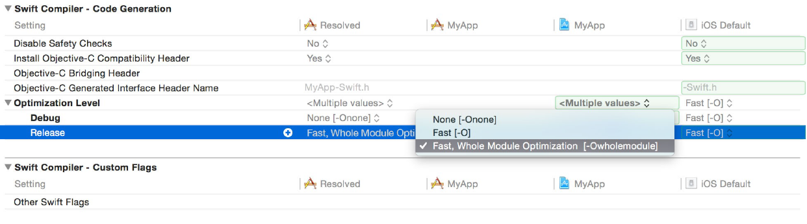

Swift 自诞生以来，就标榜了 **Performance**。WWDC 2015 上苹果为 Swift 2 引入的 Swift Compiler 特性 `Whole-Module Optimization` 将其再一次拉上了 **Performance** 的舞台，那么 `WMO` 到底做了些什么？

通常来说，Swift 文件是单独编译的，这样的编译模式不但可以充分发挥多核心的优势做到并行编译而且还能做到单文件维度的增量编译。


这很合情也和很合理，用 Apple 的话来说就是

> That's **good** 😀

然而这样会把 Optimizer 能获取到的上下文局限在单个文件内，那么显而易见的问题是，整个模块内的死函数、`Dynamic Dispatch` 的 `V-Table` 查询、泛型特例化等等都无法被很好的优化，所以精益求精的 Apple 认为，这还是不够 **good**，因此引入了 `Whole-Moudle Optimization`。


`WMO` 将整个模块的内的 Swift 文件合并成一个，把颗粒度提升到整个模块，这样可以做到在 Build Source 阶段，Optimizer 只进行一次模块级别的优化，用 Apple 的话来说就是：

> Analyze everything at once, aggressive optimization, very **good** 😀

`WMO` 对于 Swift 所能带来的提升官方称有 2x ~ 5x，如此 **good** 的性能提升使得从 Xcode 8 开始 WMO 就成为了默认标配，所以 `WMO` 快在哪？

### 泛型特例化

以 [stdlib](https://github.com/apple/swift/blob/master/stdlib/public/core/Algorithm.swift) 中的函数为例。

```
// File1.swift
@_inlineable
public func max<T : Comparable>(_ x: T, _ y: T) -> T {
    // In case `x == y`, we pick `y`. See min(_:_:).
    return y >= x ? y : x
}
```

由于是泛型，编译器无从知道 `type T` 具体类型是 `Int`、`Double` 还是其它任何 `Comparable` 的类型，所以编译器会去函数表里找类型匹配函数， 同时编译器也无从知道 `type T` 是否需要为其 `reference counting`(e.g `class Foo: Comparable`)，所以为了应付所有可能的 `type T` 情况下，编译器会保守的生成如下伪代码。

```
// File1.swift
@_inlineable
func max<T : Comparable>(x: T, y: T, FTable: FunctionTable) -> T {
    let xCopy = FTable.copy(x)
    let yCopy = FTable.copy(y)
    let ret = !FTable.lessThan(yCopy, xCopy) ? y : x
    FTable.release(x)
    FTable.release(y)
    return ret 
}
```

然而在 `runtime` 时期，对于诸如 Int 这类的基本类型来说，编译器插入的 `copy()`、`release()` 是毫无意义却又是确实存在的，所以和 `Template Specialization` 类似，Swift Compiler 引入了 `Generic Specialization`。

```
// File1.swift
func foo()  {
    let x: Int = ...
    let y: Int = ...
    let ret = max(x, y)
    ...
}
```

在这样一个上下文内，`Compiler` 能清楚的得知 `type T = Int`，因此 `max<T>` 会被拷贝并被特例化成 `max<Int>`。

```
func max<Int>(x: Int, y: Int) -> Int {
    return y < x ? x : y
}
```

然而问题是在如下的情况也是大部分工程中最常见的情况下，对于 File1.swift 来说 File2.Swift 在编译期是不可见的，`Generic Specialization` 也因此失去了作用。

```
// Module Foo

// File1.swift
@_inlineable
public func max<T : Comparable>(_ x: T, _ y: T) -> T {
    // In case `x == y`, we pick `y`. See min(_:_:).
    return y >= x ? y : x
}

// File2.swift
func bar()  {
    let x: Int = ...
    let y: Int = ...
    let ret = max(x, y)
    ...
}
```

> It's not **good** 🙁.

就时候就能体现出 `WMO` 的优势，颗粒度上升至模块之后，File1，File2 会被合并，所有 Source 处于同一上下文，因此编译器有足够的信息去优化生成成如下 high **perfromace** 的代码。

```
// Module Foo

// Foo-Merged.swift
@_inlineable
public func max<Int>(_ x: Int, _ y: Int) -> Int {
    return y >= x ? y : x
}

func bar()  {
    let x: Int = ...
    let y: Int = ...
    let ret = max<T>(x, y)
    ...
}
```

### Dynamic Dispatch

假设有一个 `class Car`。

```
// Module A

// File1.Swift
class Car {
    // should not override
    var brand: String
    func turboCharge()
    // turboCharge implementation, called by turboCharge(), should not override
    func turboChargeImpl()
}

// File1.swift
class Porsche: Car {
    var model: String
    override func turboCharge()

    // 对于子类，任何继承于父类的非 private func、property 都是以 Dynamic Dispatch
    // 的形式调用的，即使没有被 override
    // assumed to be overridden by compiler
    // func turboChargeImpl() 
}

```

然后我们有个 `class Driver`。

```
// File2.swift
class Driver {
    var name: String
    func turbo(of car: Car) {
        print("Strat turbo of \(car.brand)")
        car.turboCharge()
    }
}
```

那么对于 `Driver.turbo` 编译器会生成如下伪代码。

```
class Driver {
    ···
    func turbo(a car: Car) {
        let brandGetter = Car.brandGetter(car)
        print("Strat turbo of \(brandGetter(car))")
        let turboCharge = Car.turboCharge(car)
        turboCharge(car)
    }
    ···
}
```

由于局限于单文件 `Scope`，编译器无从得知所给到类的层级信息，自然无法得知有哪些 `property`，`func` 是被 `override`的，所以编译器必须插入间接运算以完成 `Dynamic Dispatch`。对于不会被 `override` 的 `Car.brand`、`Car.turboChargeImpl`，可以通过 `final` 限制子类的 `override` 或者通过 `private` 限制子类的 `Access Control` 来达到 `Static Dispatch`。

```
class Car {
    ···
    final var brand: String
    private func turboChargeImpl()
}
```

于是编译器就会生成如下伪代码。

```
class Driver {
    ···
    func turbo(a car: Car) {
        print("Strat turbo of \(car.brand)")
        let turboCharge = Car.turboCharge(car)
        turboCharge(car)
    }
    ···
}
```

回到 `WMO`，在上文基础上，假设有这样一个情景。

```
// Module A

// File2.swift
class Driver {
    ···
    func turbo(a porsche: Porsche) {
        porsche.turbo()
    }
    ···
}

```

这样一段代码会被改写成如下。

```
class Driver {
    ···
    func turbo(a porsche: Porsche) {
        let turboCharge = Porsche.turboCharge(porsche)
        turboCharge(car)
    }
    ···
}

```

在 `class Prosche` 没有任何 `subclass` 的情况下，`Dynamic Dispatch` 实际上是毫无意义的，因此 `WMO` 又一次发挥了作用，把 Visibility 提升到整个模块之后 Compiler 能理解 `Prosche` 的类层级、并且 `Prosche` 没有子类，因此 `func turbo(a porsche: Porsche)` 是完全 Static 的，所以代码最终会被改写成如下。

```
// Module A
// A-Merged.Swift
class Car {
    final var brand: String
    func turboCharge()
    private func turboChargeImpl()
}

class Porsche: Car {
    final var model: String
    override func turboCharge()
}

class Driver {
    
    func turbo(a car: Car) {
        print("Strat turbo of \(car.brand)")
        let turboCharge = Car.turboCharge(car)
        turboCharge(car)
    }

    func turbo(a porsche: Porsche) {
        porsche.turbo()
    }
}

```

相比于 objc 的一切皆动态，Swift 在编译器能获得丰富的信息去避免 `Dynamic Dispatch` 这也为什么 Swift 在 Object-Oriented Benchmark 上能秒杀 objc，可见一个设计优良的 `class` 不仅在工程易维护性上带来许多方便，同时在性能上也能获得巨大的收益。


## `WMO` 的适用范围

但就如上文所说的，`WMO` 下增量编译颗粒度上升至整个模块，意味着不管修改哪个文件，下一次 build 总是 Whole-Module build，大大增加了 build time，虽然 `WMO` 带来的 clean build 时间缩短是可观的，但和 `-Onone`、`SFO` 下的增量编译相比并不在一个量级，所以这对于日常的开发是没有必要的，因此 `WMO` 作为标配来说也仅仅是在 release build 的情况下，它并不是无敌的。



同时在开启了优化的情况下，`LLDB` 也会表现的不正常 

```
MyApp was compiled with optimization - stepping may behave oddly; variables may not be available.
```

所以，如果有无法避免的理由需要在 **Debug** 情况下要用到 `WMO`，那么

- **Debug** 下打开 `WMO`，`Other Swift Flags` 里添加 `-Onone`
- **Debug** 下关闭 `WMO`，`User-Defined` 里添加 `SWIFT_WHOLE_MODULE_OPTIMIZATION` = `YES`

以上两种方式都可以把所有文件合并，且不做任何编译优化，减少了 Context 的分析，不但能够 Debug，而且相比于 `Whole-Module Optimization` 还可以达到更快的编译速度。对于 CocoaPods 引入的 Swift framework，可以在 hook 里为每个 target 做配置。

```ruby
post_install do |installer|
  installer.pods_project.targets.each do |target|
    target.build_configurations.each do |config|
      if config.name == 'Debug'
        config.build_settings['SWIFT_OPTIMIZATION_LEVEL'] = '-Owholemodule'
        config.build_settings['OTHER_SWIFT_FLAGS'] = '-Onone $(inherited)'
      end
    end
  end
end
```

## 总结

`WMO` 的情况下，配合良好的代码设计会给予整个工程带来不容忽视的收益，用 Apple 的话来说就是：

> All I need to do is to turn on Whole-Module Optimization. I don't need to change code at all. By giving the compiler more information, by allowing the compiler to understand my class hierachy with more information, I was able to get this optimization for **free** without any work on your part.


## 进一步了解
0. [Whole-Module Optimization in Swift 3](https://swift.org/blog/whole-module-optimizations/)
1. [Optimizing Swift Performance](https://developer.apple.com/videos/play/wwdc2015/409/)
2. [Speeding Up Compile Times of Swift Projects](http://developear.com/blog/2016/12/30/Speed-Swift-Compilation.html)
3. [Swift with a hundred engineers](https://www.skilled.io/u/swiftsummit/swift-with-a-hundred-engineers)
4. [Chris Lattner's Homepage](http://nondot.org/sabre/)